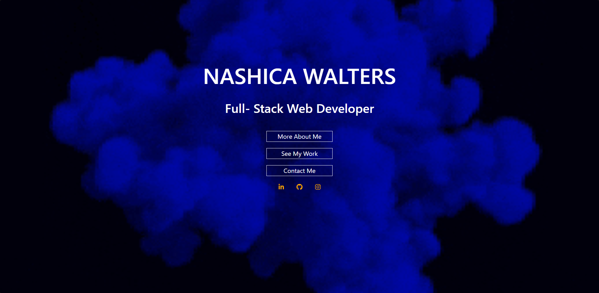

# Portfolio

 
 
 
 
 

## Table of Contents
* [Description](#description)
* [Technology](#technology)
* [Screenshot](#screenshot)
* [Credits](#credits)
* [Contact](#contact)
* [License](#license)

## Description
This is a portfolio made with react.js. React comes with a number of features that help speed up the workflow. First of all, components let you create reusable elements across projects. The app is deployed to Github Pages.

## Technology
[Node.js](https://nodejs.org/en/)

[React](https://reactjs.org/)

## Screenshot

## Credits
* [Adam Simonini](https://github.com/adamsimonini)

## Contact
If you have any questions, I can be reached via:
* <bold>Email</bold>: nash.walters@outlook.com

## License 
Copyright © 2021 Nash Walters
